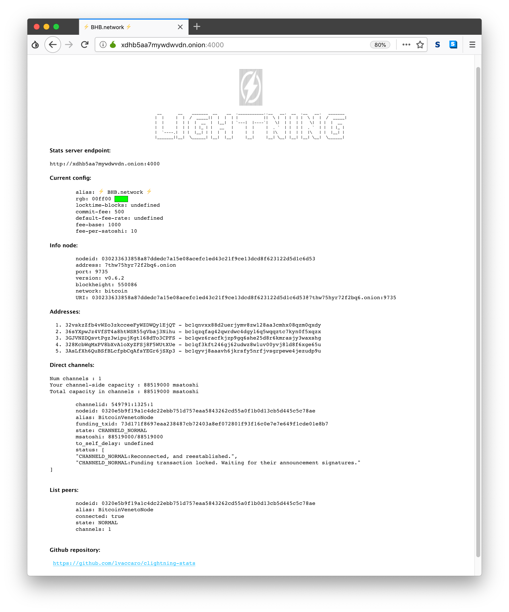

# clightning-stats [](https://travis-ci.org/lvaccaro/clightning-stats)
Web stats of [clightning](https://github.com/ElementsProject/lightning) node #LightningNetworks.

* [Install](#install)
* [Configure](#configure)
  * [Configure the environment](#configure-the-environment)
* [Automatic startup](#automatic-startup)
* [Screenshot](#screenshot)
* [Donations](#donations)

## Install
Clone the repository then run `npm install` in the cloned directory in order to install dependencies and libraries.

Start the server with the command:
```shell
npm start
```

## Configure
If you want you can start the server changing the default environment options:
* `PORT` : server localport (default: 4000)
* `LIGHTNINGDIR` : folder of lightning rpc file (default ~/.lightning)

Plus configure the frontend specific information of your node.

### Configure the environment
A simple export of variables make the magic as in the following command:
```shell
PORT=4000 LIGHTNINGDIR=$HOME/.lightning npm start
```
Or if you want start as daemon:
```shell
export PORT=4000
export LIGHTNINGDIR=$HOME/.lightning
nohup npm start &
```

Check the working website opening the url:
```shell
open localhost:4000
```

## Automatic startup
If you want run automatically this information page consider to run it using the PM2 with the `launch.sh` script.

Configure the `launch.sh` script with your custom information and run it using the command `pm2 start launch.sh`.

## Screenshot



## Donations

Donations are welcome: `1LNST1ZR2dhRLg7AHfr3NLj4Yv5jMQCWgJ`
